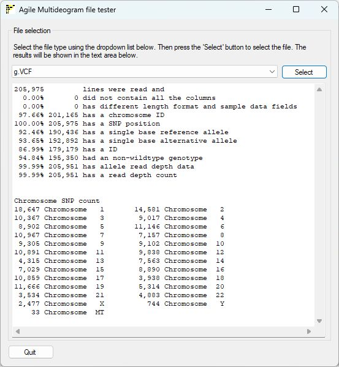
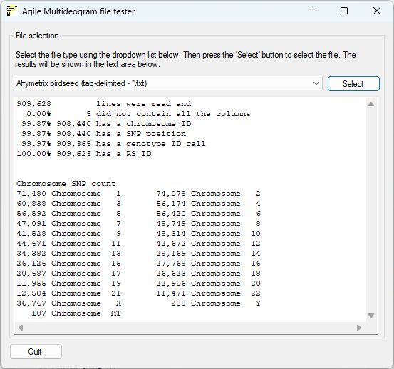

# AgileMultideogramFileTester

## Contents

- [AgileMultideogramFileTester](#agilemultideogramfiletester) 
  - [Introduction](#introduction) 
  - [Guide](#guide)
  - [Download](download/README.md)
  - [Running on Linux systems](#running-on-linux-systems)
  
## Introduction

```AgileMultideogramFileTester``` was created to check the format and data content of files to be used by ```AgileMultideogram```. These can be the original Affymetrix tab-delimited text files (*.xls), the Affymettrix birdseed tab-delimited text files (*.txt), VCF files (*.vcf) or genomic VCF files (*.g.vcf). These files can be read even if they are gzip compressed (*.txt.gz, *.xls.gz, *.vcf.gz or *.g.vcf.gz)

To use first select the file type from the dropdown list and then press the ***Select*** button to pick your data file. Once selected, ```AgileMultideogramFileTester``` will read the file, looking for the required columns and then if found, count all the variants that have each of the required values. If a field is found to be missing ```AgileMultideogramFileTester``` will report on which fields are missing and will not attempt to read the file.

## Guide

### VCF and gVCF outputs



Figure 1: Analysis of a VCF file

***Note:*** Due to the size of genomic VCF files, processing them may take a while. 

VCF and gVCF files are processed the same and produce the same output (Figure 1), with one exception: 

- Variants in VCF files can have only 1 reference and 1 alternative alleles that are 1 base long.
- Variants in the in VCF files can have only 1 reference and 1 alternative alleles that are 1 base long, but the entry in the file for the alternative allele can be formatted as ***G,<NON_REF>***.

#### Notes
- ```AgileMultideogramFileTester``` only counts lines that do not start with a **#** character.
- The third line-"has different length format and sample data fields" refers to the number of entries in the FORMAT and sample fields.
- Chromosome IDs are case insensitive and can be **X**, **Y**, **M**, **MT** or a number from **1** to **100**. The ID can be with or without a **chr** prefix.
- The tenth and eleventh line refer to the AD and DP fields in the FORMAT column.
- If a chromosome contains no SNPs it will be omitted from the list.

### Affymetrix *.xls and birdseed *.txt files



Figure 2: Analysis of an Affymetrix file

*.xls and birdseed files are processed the same and produce the same output (Figure 1), with with the minor differences in the column heads used:

|Column|*.xls|Birdseed|
|-|-|-|
|Chromosome ID|Chromosome|Chromosome|
|Position|Physical Position|Chromosomal Position|
|SNP ID|dbSNP RS ID|dbSNP RS ID|
|Genotype|Must have Call in name|Must have Call in name|

#### Notes

- Column names are case insensitive.
- Genotypes can only be **AA**, **BB**, **AB** and are case insensitive.
- An ID name must be longer than 2 characters
- Chromosome IDs are case insensitive and can be **X**, **Y**, **M**,  **MT** or a number from **1** to **100**. The ID can be with or without the **chr** prefix.
- If a chromosome contains no SNPs it will be omitted from the list.

## Running on Linux systems
The prebuilt programs can be run on Linux (and macOS) using the Wine package as described [here](https://github.com/msjimc/RunningWindowsProgramsOnLinux/blob/main/README.md).